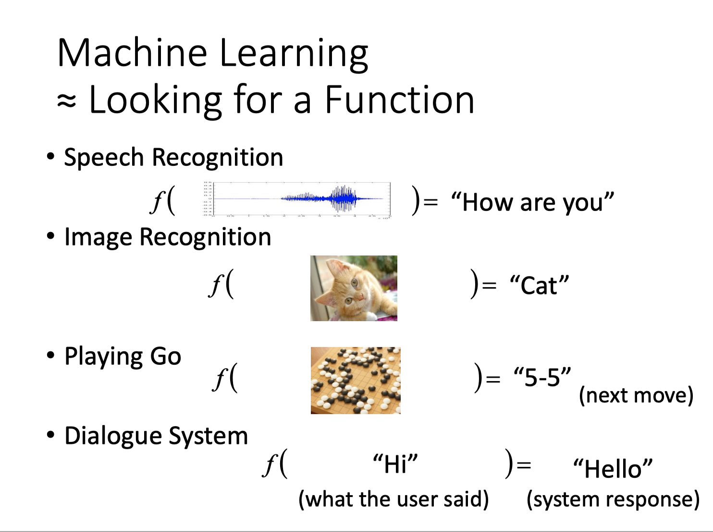
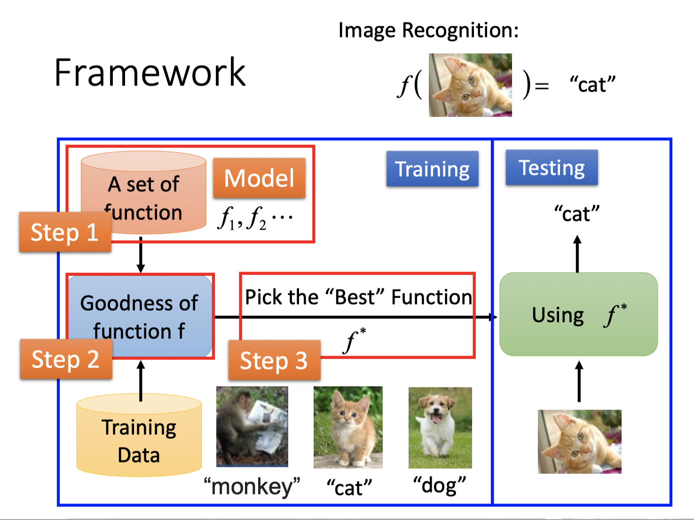
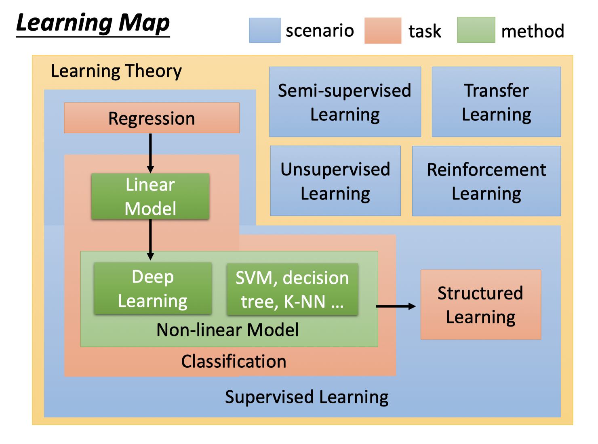
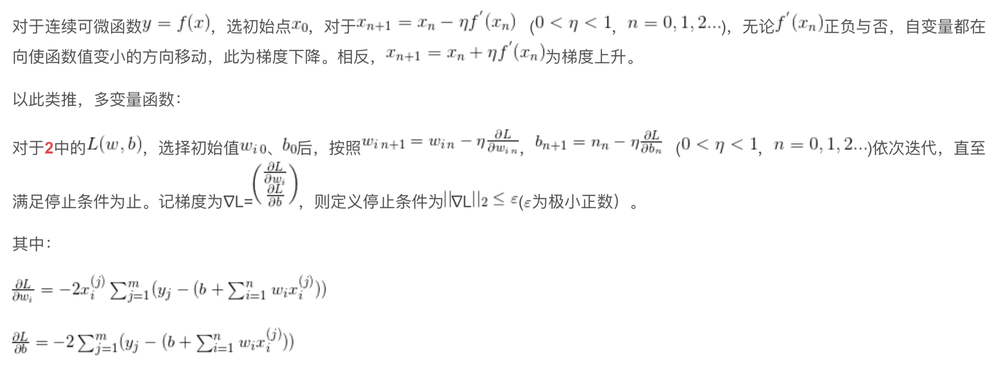

#Task1

---

# 目录

## 0、了解什么是Machine learning







## 1、中心极限定理

> **中心极限定理**是[概率论](https://zh.wikipedia.org/wiki/概率论)中的一组定理。中心极限定理说明，在适当的条件下，大量相互独立[随机变量](https://zh.wikipedia.org/wiki/随机变量)的均值经适当标准化后[依分布收敛](https://zh.wikipedia.org/wiki/依分布收敛)于[正态分布](https://zh.wikipedia.org/wiki/正态分布)。这组定理是[数理统计学](https://zh.wikipedia.org/wiki/数理统计学)和误差分析的理论基础，指出了大量随机变量之和近似服从正态分布的条件。

### 1.1 棣莫佛－拉普拉斯定理

> 棣莫佛－拉普拉斯（de Moivre - Laplace）定理是中央极限定理的最初版本，讨论了服从[二项分布](https://zh.wikipedia.org/wiki/二项分布)的随机变量序列。它指出，参数为*n*, *p*的二项分布以*np*为均值、*np(1-p)*为方差的正态分布为极限


$$
若 {\displaystyle X\sim B(n,p)} 是 {\displaystyle n}次伯努利实验中事件 A 出现的次数，每次试验成功的概率为 {\displaystyle p} p，且 {\displaystyle q=1-p}，则对任意有限区间 {\displaystyle [a,b]}：
令 {\displaystyle x_{k}\equiv {\frac {k-np}{\sqrt {npq}}}}，当 {\displaystyle n\to {\infty }}时
$$


$$
\begin{array}{l}{\text { (i) } P(X=k) \rightarrow \frac{1}{\sqrt{n p q}} \cdot \frac{1}{\sqrt{2 \pi}} e^{-\frac{1}{2} x_{\mu_{n}}^{2}}} \\ {\text { (ii) } P\left(a \leq \frac{X-n p}{\sqrt{n p q}} \leq b\right) \rightarrow \int_{a}^{b} \varphi(x) d x, \# \Psi \varphi(x)=\frac{1}{\sqrt{2 \pi}} e^{-\frac{x^{2}}{2}}(-\infty<x<\infty)}\end{array}
$$

### 1.2 林德伯格－列维定理

> 林德伯格－列维（Lindeberg-Levy）定理，是棣莫佛－拉普拉斯定理的扩展，讨论独立同分布随机变量序列的中央极限定理。它表明，独立同分布(iid independent and indentically distributed)、且数学期望和方差有限的随机变量序列的标准化和以标准正态分布为极限

$$
设随机变量 {\displaystyle X_{1},X_{2},\cdots ,X_{n}} X_{1},X_{2},\cdots ,X_{n}独立同分布， 且具有有限的数学期望和方差 {\displaystyle E(X_{i})=\mu } E(X_{i})=\mu ， {\displaystyle D(X_{i})=\sigma ^{2}\neq 0(i=1,2,\cdots ,n)} D(X_{i})=\sigma ^{2}\neq 0(i=1,2,\cdots ,n)，记
$$

$$
\overline{X}=\frac{1}{n} \sum_{i=1}^{n} X_{i}, \zeta_{n}=\frac{\overline{X}-\mu}{\sigma / \sqrt{n}}, \quad \underset{n \rightarrow \infty}{\lim } P\left(\zeta_{n} \leq z\right)=\Phi(z)
$$

$$
其中 {\displaystyle \Phi (z)} \Phi (z)是标准正态分布的分布函数
$$

## 2、正态分布

> **正态分布**（英语：normal distribution）又名**高斯分布**（英语：**Gaussian distribution**），是一个非常常见的[连续概率分布](https://zh.wikipedia.org/wiki/概率分布)。正态分布在[统计学](https://zh.wikipedia.org/wiki/统计学)上十分重要，经常用在[自然](https://zh.wikipedia.org/wiki/自然科学)和[社会科学](https://zh.wikipedia.org/wiki/社会科学)来代表一个不明的随机变量

$$
若随机变量 {\displaystyle X} 服从一个位置参数为 {\displaystyle \mu }、尺度参数为 {\displaystyle \sigma } 的正态分布，记为：
$$

$$
X \sim N\left(\mu, \sigma^{2}\right)
$$

$$
则其概率密度函数为
$$

$$
f(x)=\frac{1}{\sigma \sqrt{2 \pi}} e^{-\frac{(x-\mu)^{2}}{2 \sigma^{2}}}
$$


## 3、最大似然估计

> 在[统计学](https://zh.wikipedia.org/wiki/统计学)中，**最大似然估计**（英语：maximum likelihood estimation，缩写为MLE），也称**最大概似估计**，是用来[估计](https://zh.wikipedia.org/wiki/估计函数)一个[概率模型](https://zh.wikipedia.org/wiki/概率模型)的参数的一种方法。

$$
给定一个概率分布 {\displaystyle D} ，已知其概率密度函数（连续分布）或概率质量函数（离散分布）为 {\displaystyle f_{D}}，以及一个分布参数 {\displaystyle \theta } ，我们可以从这个分布中抽出一个具有 {\displaystyle n} 个值的采样 {\displaystyle X_{1},X_{2},\ldots ,X_{n}}，利用 {\displaystyle f_{D}}计算出其似然函数：

{\displaystyle {\mbox{L}}(\theta \mid x_{1},\dots ,x_{n})=f_{\theta }(x_{1},\dots ,x_{n}).}
$$

$$
若 {\displaystyle D}是离散分布， {\displaystyle f_{\theta }}即是在参数为 {\displaystyle \theta }时观测到这一采样的概率。若其是连续分布， {\displaystyle f_{\theta }} 则为 {\displaystyle X_{1},X_{2},\ldots ,X_{n}}, X_n联合分布的概率密度函数在观测值处的取值。一旦我们获得 {\displaystyle X_{1},X_{2},\ldots ,X_{n}} ，我们就能求得一个关于 {\displaystyle \theta }的估计。最大似然估计会寻找关于 {\displaystyle \theta }的最可能的值（即，在所有可能的 {\displaystyle \theta }  取值中，寻找一个值使这个采样的“可能性”最大化）。从数学上来说，我们可以在 {\displaystyle \theta } 的所有可能取值中寻找一个值使得似然函数取到最大值。这个使可能性最大的 {\displaystyle {\widehat {\theta }}} 值即称为 {\displaystyle \theta }的最大似然估计。由定义，最大似然估计是样本的函数。
$$

## 4、泰勒公式

> 泰勒展开就是用形式简单的多项式来近似在x0邻域内的函数，展开越多近似程度越高
>
> 设 n 是一个正整数。如果定义在一个包含 a 的区间上的函数 f 在 a 点处 n+1 次可导，那么对于这个区间上的任意 x，都有：
> $$
> f(x)=f(a)+\frac{f^{\prime}(a)}{1 !}(x-a)+\frac{f^{(2)}(a)}{2 !}(x-a)^{2}+\cdots+\frac{f^{(n)}(a)}{n !}(x-a)^{n}+R_{n}(x)
> $$
> 

## 5、Loss function

> 损失函数（loss function）是用来估量你模型的预测值f(x)与真实值Y的不一致程度，它是一个非负实值函数,通常使用L(Y, f(x))来表示，损失函数越小，模型的鲁棒性就越好。损失函数是经验风险函数的核心部分，也是结构风险函数重要组成部分。模型的结构风险函数包括了经验风险项和正则项，通常可以表示成如下式子： 
> $$
> \theta^{*}=\arg \min _{\theta} \frac{1}{N} \sum_{i=1}^{N} L\left(y_{i}, f\left(x_{i} ; \theta\right)+\lambda \Phi(\theta)\right.
> $$
> **Model**:
> $$
> y_{\text {pre}}=b+\sum_{i=1}^{n} w_{i} x_{i}
> $$
> **L2 Loss Fuction:** 
> $$
> L(w, b)=\sum_{j=1}^{m}\left(y_{j}-y_{p r e}^{(j)}\right)^{2}=\sum_{j=1}^{m}\left(y_{j}-\left(b+\sum_{i=1}^{n} w_{i} x_{i}^{(j)}\right)\right)^{2}
> $$
>
> **m为样本点计数、y为训练集真是输出、xi为训练集特征值、w为权重、b为偏置值、ypre为预测值**

## 6、损失函数与凸函数

在无约束损失函数优化问题中，如果损失函数在所属凸集上为凸函数且可微，则可以通过梯度下降法找到全局最小值；否则，根据初始点的选择不同，只能在其小邻域内寻找局部最小值。

## 7、全局最优和局部最优

对于严格凸函数来说，局部最优=全局最优；

对于非凸函数来说，在局部可微的前提下，可以找到多个局部最优解，但很难确定其是否为全局最优。

## 8、为什么只对w/Θ做限制，不对b做限制

b的变化只对函数的位置有影响，并不改变函数的平滑性；相反，对w的限制可以实现对特征的惩罚，留取更重要的特征，惩罚不重要的特征权重，从而使LF更平滑，提高泛化能力，防止过拟合。

## 9、梯度下降

> $$
> \nabla L=\left( \begin{array}{l}{\frac{\partial L}{\partial w_{i}}} \\ {\frac{\partial L}{\partial b}}\end{array}\right)
> $$
>
> $$
> w_{i n+1}=w_{i n}-\eta \frac{\partial L}{\partial w_{i n}}, \quad b_{n+1}=n_{n}-\eta \frac{\partial L}{\partial b_{n}} \quad(0<\eta<1, n=0,1,2 . .)
> $$



### 代码：

```python
from sympy import *
from mpl_toolkits.mplot3d import Axes3D
import matplotlib.pyplot as plt
import numpy as np
import random
 
class GradientDescent:
    def __init__(self, eta=0.01, iter_num=1000, stop_condition=0.01):
        self.eta = eta # 学习率
        self.iter_num = iter_num # 迭代次数
        self.stop_condition = stop_condition # 停止条件
        self.x1, self.x2 = symbols('x1, x2')
        self.x_1 = np.arange(-50, 50, 0.05)
        self.x_2 = np.arange(-50, 50, 0.05)
 
    def function(self):
        '''定义函数'''
        y = 10 * self.x1**2 + 20 * self.x2**2 + 5
        return y
        # result: 10*x1**2 + 20*x2**2 + 5
 
    def plot_3d(self):
        '''绘制y的曲面图'''
        x_1, x_2 = np.meshgrid(self.x_1, self.x_2)
        y_ = np.zeros(x_1.shape)
        for i in range(2000):
            for j in range(2000):
                y_[i, j] = 10 * x_1[i, j] ** 2 + 20 * x_2[i, j] ** 2 + 5
 
        fig = plt.figure()
        ax = Axes3D(fig)
        ax.plot_surface(x_1, x_2, y_, cmap='rainbow')
        plt.xlabel('x1')
        plt.ylabel('x2')
        plt.show()
 
    def gradientdescent(self):
        # 随机选择初始点
        x1_0 = random.randint(40, 50) * (-1)**random.randint(0, 2)
        x2_0 = random.randint(40, 50) * (-1)**random.randint(0, 2)
        print('随机选择初始点：(%d, %d)' % (x1_0, x2_0))
        # 调用定义的函数y
        y = self.function()
        k = 1
        while k <= self.iter_num:
            x1_n = x1_0 - self.eta * diff(y, self.x1, 1).subs(self.x1, x1_0)
            x2_n = x2_0 - self.eta * diff(y, self.x2, 1).subs(self.x2, x2_0)
            x1_0, x2_0 = x1_n, x2_n
            nabla_L = [int(diff(y, self.x1, 1).subs(self.x1, x1_0)), int(diff(y, self.x2, 1).subs(self.x2, x2_0))]
            # 如果梯度2范数小于定义的极小值，则停止迭代
            if np.linalg.norm(nabla_L) <= self.stop_condition:
                print('迭代次数：%d' % k)
                print('迭代全局最小值：(%d, %d, %d)' % (x1_0, x2_0, y.subs({self.x1:x1_0, self.x2:x2_0})))
                break
            k += 1
 
a = GradientDescent()
a.plot_3d()
a.function()
a.gradientdescent()


a = GradientDescent()
a.function()
10*x1**2 + 20*x2**2 + 5
a.gradientdescent()
随机选择初始点：(-46, 50)
迭代次数：31
迭代全局最小值：(0, 0, 5)
```

## 10、L2-Norm，L1-Norm，L0-Norm区别

> 监督学习的过程可以概括为：最小化误差的同时规则化参数。最小化误差是为了让模型拟合训练数据，规则化参数是为了防止过拟合。参数过多会导致模型复杂度上升，产生过拟合，即训练误差很小，但测试误差很大，这和监督学习的目标是相违背的。所以需要采取措施，保证模型尽量简单的基础上，最小化训练误差，使模型具有更好的泛化能力（即测试误差也很小）
>
> 范数规则化有两个作用：
>
> 1）保证模型尽可能的简单，避免过拟合。
>
> 2）约束模型特性，加入一些先验知识，例如稀疏、低秩等。
>
> 问题：
>
> 1）实现参数的稀疏有什么好处吗？
>
> 一个好处是可以简化模型，避免过拟合。因为一个模型中真正重要的参数可能并不多，如果考虑所有的参数起作用，那么可以对训练数据可以预测的很好，但是对测试数据就只能呵呵了。另一个好处是参数变少可以使整个模型获得更好的可解释性。
>
> 2）参数值越小代表模型越简单吗？
>
> 是的。为什么参数越小，说明模型越简单呢，这是因为越复杂的模型，越是会尝试对所有的样本进行拟合，甚至包括一些异常样本点，这就容易造成在较小的区间里预测值产生较大的波动，这种较大的波动也反映了在这个区间里的导数很大，而只有较大的参数值才能产生较大的导数。因此复杂的模型，其参数值会比较大。


### L0-Norm

> L0是指向量中非0的元素的个数。如果我们用L0范数来规则化一个参数矩阵W的话，就是希望W的大部分元素都是0。换句话说，让参数W是稀疏的。
>
> 但不幸的是，L0范数的最优化问题是一个NP hard问题，而且理论上有证明，L1范数是L0范数的最优凸近似，因此通常使用L1范数来代替。

$$
\|x\|_{0}=\#(i) \text { with } x_{i} \neq 0
$$

### L1-Norm

> L1范数是指向量中各个元素绝对值之和，也有个美称叫“稀疏规则算子”（Lasso regularization）。
>
> L1正则化之所以可以防止过拟合，是因为L1范数就是各个参数的绝对值相加得到的，我们前面讨论了，参数值大小和模型复杂度是成正比的。因此复杂的模型，其L1范数就大，最终导致损失函数就大，说明这个模型就不够好。

$$
\|x\|_{1}=\sum_{i=1}^{n}\left|x_{i}\right|
$$

### L2-Norm

> 也叫“岭回归”（Ridge Regression），也叫它“权值衰减weight decay”
>
> 但与L1范数不一样的是，它不会是每个元素为0，而只是接近于0。越小的参数说明模型越简单，越简单的模型越不容易产生过拟合现象。

$$
\|x\|_{2}=\sqrt{\sum_{i=1}^{n} x_{i}^{2}}
$$

## 11、正则化公式

> **对于**
> $$
> Y=W X
> $$
> **无L2正则化项损失函数：**
> $$
> L=\frac{1}{2}\left(W X-Y_{\text {real}}\right)^{2}
> $$
> **对W求偏导并=0得：**
> $$
> W=\left(X^{T} X\right)^{-1} X^{T} Y
> $$
> **有L2正则化项损失函数**：
> $$
> L=\frac{1}{2}\left(W X-Y_{\text {real}}\right)^{2}+\frac{1}{2} \lambda W^{2}
> $$
> **对W求偏导并=0得：**
> $$
> W=\left(X^{T} X+\lambda I\right)^{-1} X^{T} Y
> $$
> 

## 12、参考

[为什么L1稀疏，L2平滑？](https://vimsky.com/article/969.html)

[l1 相比于 l2 为什么容易获得稀疏解？](https://link.jianshu.com/?t=https://www.zhihu.com/question/37096933)

[L0,L1,L2正则化浅析](https://link.jianshu.com/?t=http://blog.csdn.net/vividonly/article/details/50723852)

[Regression Hung-yi Lee](http://speech.ee.ntu.edu.tw/~tlkagk/courses.html)

[泰勒公式的展开细节解析](<https://blog.csdn.net/dog250/article/details/76697167>)

[**泰勒公式的详细推导**](https://blog.csdn.net/weixin_40100502/article/details/80531027)