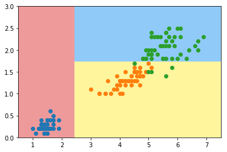

## Task10

### Gini指数

**基尼指数Gini(D)表示集合D不确定性，基尼指数Gini(D，A=a)表示集合D经A=a分割后的不确定性(类似于熵)，基尼指数越小，样本的不确定性越小。** 

> 假设有k个类，样本点属于k的概率Pk，则概率分布的基尼指数为
> $$
> \operatorname{Gini}(p)=\sum_{k=1}^{K} p_{k}\left(1-p_{k}\right)=1-\sum_{k=1}^{K} p_{k}^{2}
> $$
> 根据基尼指数定义，可以得到样本集合D的基尼指数，其中Ck表示数据集D中属于第k类的样本子集
> $$
> \operatorname{Gini}(D)=1-\sum_{k=1}^{K}\left(\frac{\left|C_{k}\right|}{|D|}\right)^{2}
> $$
> 如果数据集D根据特征A在某一取值a上进行分割，得到D1,D2两部分后，那么在特征A下集合D的基尼系数如下所示。其中基尼系数Gini(D)表示集合D的不确定性，基尼系数Gini(D,A)表示A=a分割后集合D的不确定性。基尼指数越大，样本集合的不确定性越大。
> $$
> \operatorname{Gain}_{-} \operatorname{Gini}(D, A)=\frac{|D 1|}{|D|} \operatorname{Gini}\left(D_{1}\right)+\frac{|D 1|}{|D|} \operatorname{Gini}\left(D_{2}\right)
> $$
> 对于属性A，分别计算任意属性值将数据集划分为两部分之后的Gain_Gini，选取其中的最小值，作为属性A得到的最优二分方案。然后对于训练集S，计算所有属性的最优二分方案，选取其中的最小值，作为样本及S的最优二分方案。
> $$
> \min _{i \in A}\left(\operatorname{Gain}_{-} \operatorname{Gini}(D, A)\right)
> $$
> 
> $$
> \min _{\text {AeAttribute}}\left(\min _{i \in A}\left(\operatorname{Gain}_{-} \operatorname{Gini}(D, A)\right)\right)
> $$


## 基尼系数


```python
import numpy as np
import matplotlib.pyplot as plt
```


```python
from sklearn import datasets

iris = datasets.load_iris()
X = iris.data[:,2:]
y = iris.target
```


```python
from sklearn.tree import DecisionTreeClassifier

dt_clf = DecisionTreeClassifier(max_depth=2, criterion="gini", random_state=42)
dt_clf.fit(X, y)
```


    DecisionTreeClassifier(class_weight=None, criterion='gini', max_depth=2,
                max_features=None, max_leaf_nodes=None,
                min_impurity_decrease=0.0, min_impurity_split=None,
                min_samples_leaf=1, min_samples_split=2,
                min_weight_fraction_leaf=0.0, presort=False, random_state=42,
                splitter='best')


```python
def plot_decision_boundary(model, axis):
    
    x0, x1 = np.meshgrid(
        np.linspace(axis[0], axis[1], int((axis[1]-axis[0])*200)).reshape(-1, 1),
        np.linspace(axis[2], axis[3], int((axis[3]-axis[2])*200)).reshape(-1, 1),
    )
    X_new = np.c_[x0.ravel(), x1.ravel()]

    y_predict = model.predict(X_new)
    zz = y_predict.reshape(x0.shape)

    from matplotlib.colors import ListedColormap
    custom_cmap = ListedColormap(['#EF9A9A','#FFF59D','#90CAF9'])
    
    plt.contourf(x0, x1, zz, cmap=custom_cmap)
```


```python
plot_decision_boundary(dt_clf, axis=[0.5, 7.5, 0, 3])
plt.scatter(X[y==0,0], X[y==0,1])
plt.scatter(X[y==1,0], X[y==1,1])
plt.scatter(X[y==2,0], X[y==2,1])
plt.show()
```





### 模拟使用基尼系数划分


```python
from collections import Counter
from math import log

def split(X, y, d, value):
    index_a = (X[:,d] <= value)
    index_b = (X[:,d] > value)
    return X[index_a], X[index_b], y[index_a], y[index_b]

def gini(y):
    counter = Counter(y)
    res = 1.0
    for num in counter.values():
        p = num / len(y)
        res -= p**2
    return res

def try_split(X, y):
    
    best_g = float('inf')
    best_d, best_v = -1, -1
    for d in range(X.shape[1]):
        sorted_index = np.argsort(X[:,d])
        for i in range(1, len(X)):
            if X[sorted_index[i], d] != X[sorted_index[i-1], d]:
                v = (X[sorted_index[i], d] + X[sorted_index[i-1], d])/2
                X_l, X_r, y_l, y_r = split(X, y, d, v)
                p_l, p_r = len(X_l) / len(X), len(X_r) / len(X)
                g = p_l * gini(y_l) + p_r * gini(y_r)
                if g < best_g:
                    best_g, best_d, best_v = g, d, v
                
    return best_g, best_d, best_v
```


```python
best_g, best_d, best_v = try_split(X, y)
print("best_g =", best_g)
print("best_d =", best_d)
print("best_v =", best_v)
```

    best_g = 0.3333333333333333
    best_d = 0
    best_v = 2.45

```python
X1_l, X1_r, y1_l, y1_r = split(X, y, best_d, best_v)
```


```python
gini(y1_l)
```


    0.0


```python
gini(y1_r)
```


    0.5


```python
best_g2, best_d2, best_v2 = try_split(X1_r, y1_r)
print("best_g =", best_g2)
print("best_d =", best_d2)
print("best_v =", best_v2)
```

    best_g = 0.1103059581320451
    best_d = 1
    best_v = 1.75

```python
X2_l, X2_r, y2_l, y2_r = split(X1_r, y1_r, best_d2, best_v2)
```


```python
gini(y2_l)
```


    0.1680384087791495


```python
gini(y2_r)
```


    0.04253308128544431


### 回归、分类树

​		分类与回归树的英文是*Classfication And Regression Tree*，缩写为CART。CART算法采用**二分递归分割的技术**将当前样本集分为两个子样本集，使得生成的每个非叶子节点都有两个分支。非叶子节点的特征取值为**True**和**False**，左分支取值为**True**，右分支取值为**False**，因此CART算法生成的决策树是结构简洁的二叉树。CART可以处理连续型变量和离散型变量，利用训练数据递归的划分特征空间进行建树，用验证数据进行剪枝。

- 如果待预测分类是离散型数据，则CART生成分类决策树。
- 如果待预测分类是连续性数据，则CART生成回归决策树。


### 剪枝

1、形成子树序列：从生成算法产生的决策树T0底端开始不断剪枝，直到T0的根结点，形成子树序列{T0,T1…Tn}；

剪枝过程中，计算子树的损失函数：
$$
C_{\alpha}(T)=C(T)+\alpha|T|
$$
对固定的a一定存在损失函数最小的子树，表示为Ta，当a变大时，最优子树Ta偏小，a=0时，整体树最优，a趋近无穷大，单结点最优；将a从小增大
$$
0=\alpha_{0}<\alpha_{1}<\cdots<\alpha_{n}<+\infty
$$
最有字数序列：
$$
\left\{T_{0}, T_{1}, \cdots, T_{n}\right\}
$$
从T0开始剪枝，以t为单结点树的损失函数：
$$
C_{\alpha}(t)=C(t)+\alpha
$$
以t为根结点的子树Tt的损失函数：
$$
C_{\alpha}\left(T_{t}\right)=C\left(T_{t}\right)+\alpha\left|T_{t}\right|
$$
当a=0及a很小时，
$$
C_{\alpha}\left(T_{i}\right)<C_{\alpha}(t)
$$
不断增大a，当
$$
C_{\alpha}\left(T_{t}\right)=C_{\alpha}(t) \quad \alpha=\frac{C(t)-C\left(T_{t}\right)}{\left|T_{t}\right|-1}
$$
Tt与t有相同损失函数值，但t结点更少，所以剪枝Tt，对T0中每个内部结点t，计算：
$$
g(t)=\frac{C(t)-C\left(T_{t}\right)}{\left|T_{t}\right|-1}
$$
书里对g(t)的解释是：

> 它表示剪枝后整体损失函数减少的程度

这么说应该剪掉以g(t)最大结点为根的子树，因为g(t)最大，那么剪枝后整体损失函数减少程度也最大。但书中的算法却说优先剪去g(t)最小的子树，困惑了我好久。

> 实际上这个g(t)表示剪枝的阈值，即对于某一结点a，当总体损失函数中的参数alpha = g(t)时，剪和不剪总体损失函数是一样的（这可以在书中（5.27）和（5.28）联立得到）。这时如果alpha稍稍增大，那么不剪的整体损失函数就大于剪去的。<b>即alpha大于g(t)该剪，剪了会使整体损失函数减小；alpha小于g(t)不该剪，剪了会使整体损失函数增大。</b>（请注意上文中的总体损失函数，对象可以是以a为根的子树，也可以是整个CART树，对a剪枝前后二者的总体损失函数增减是相同的。）
>
> 对于同一棵树的结点，alpha都是一样的，当alpha从0开始缓慢增大，总会有某棵子树该剪，其他子树不该剪的情况，即alpha超过了某个结点的g(t)，但还没有超过其他结点的g(t)。这样随着alpha不断增大，不断地剪枝，就得到了n+1棵子树，接下来只要用独立数据集测试这n+1棵子树，试试哪棵子树的误差最小就知道那棵是最好的方案了。

在T0中剪去g(t)最小的Tt，将得到的子树作为T1，同时将最小的g(t)设为a1，T1为区间[a1,a2) 的最优子树；

直到根节点，不断增加a的值，产生新的区间。

2、通过交叉验证法在独立的验证数据集上对子树序列{T0,T1…Tn}进行测试，从中选择最优子树Ta；

即，利用独立的验证数据集，测试子树序列中各子树的平方误差或基尼指数，最小的决策树就是最优决策树。


### 参考

> https://www.zhihu.com/question/22697086
>
> https://blog.csdn.net/Crafts_Neo/article/details/92797049
>
> 《统计学习方法》李航