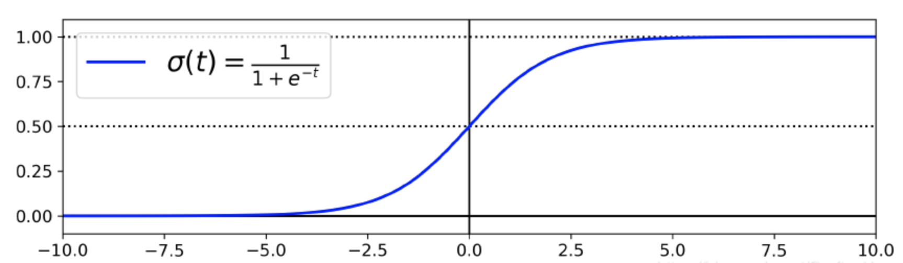
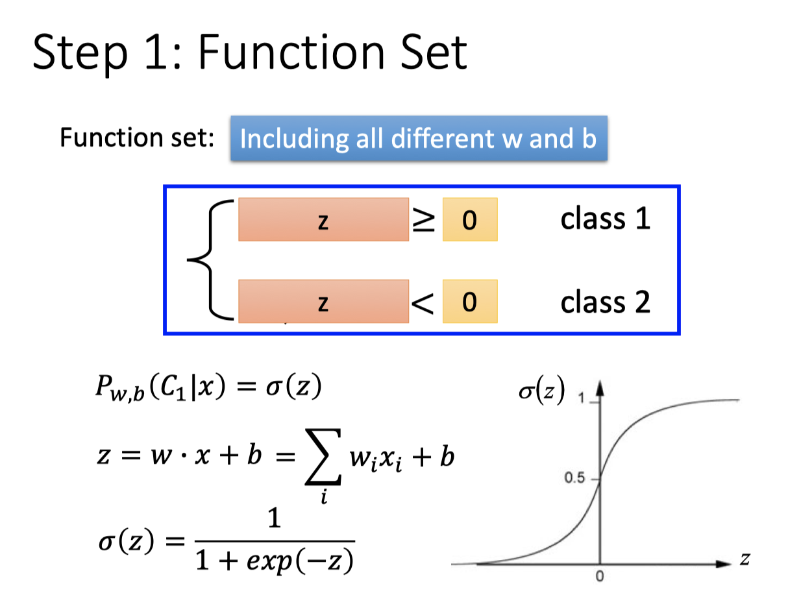
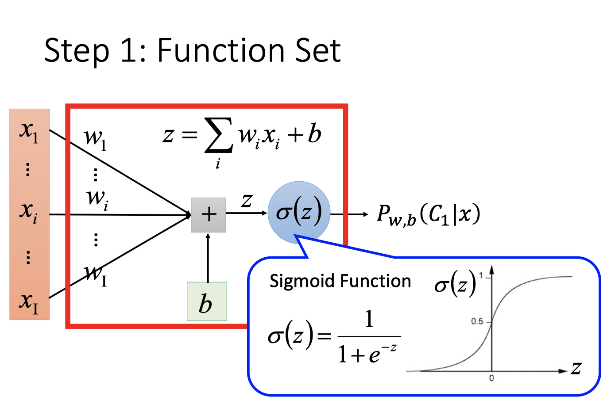
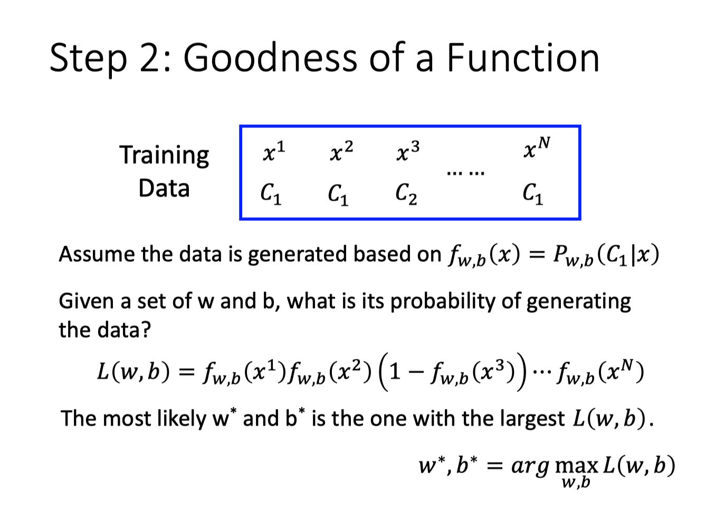
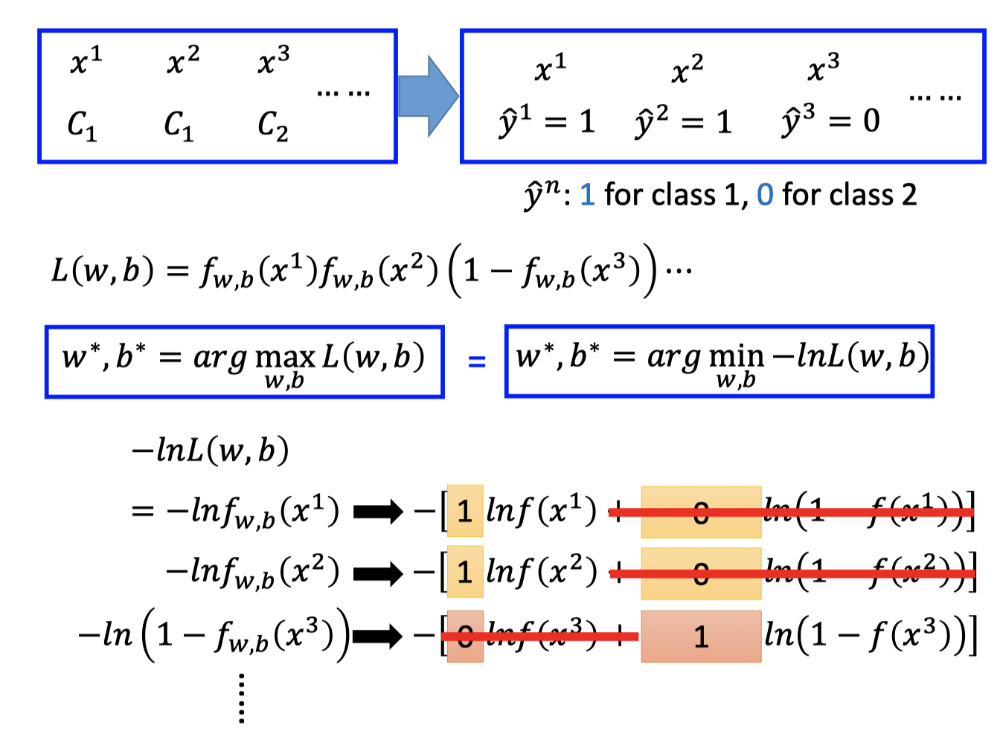
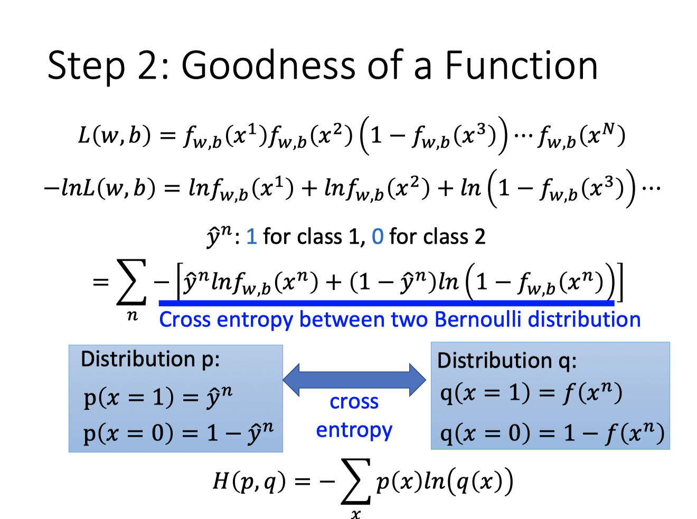
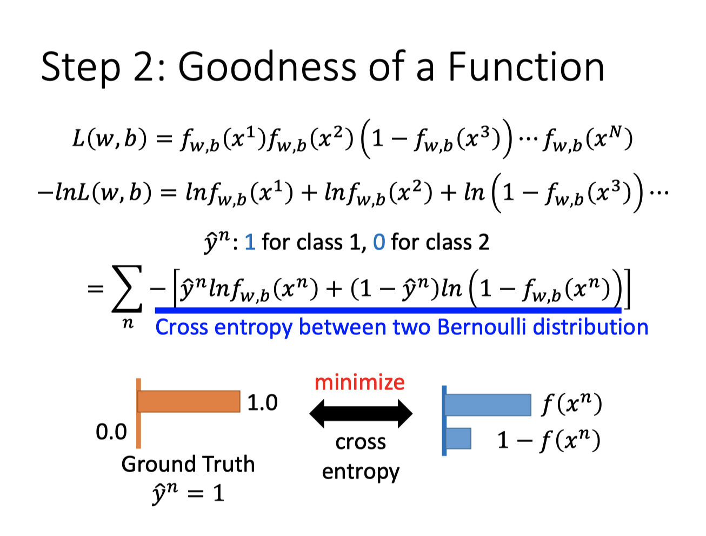
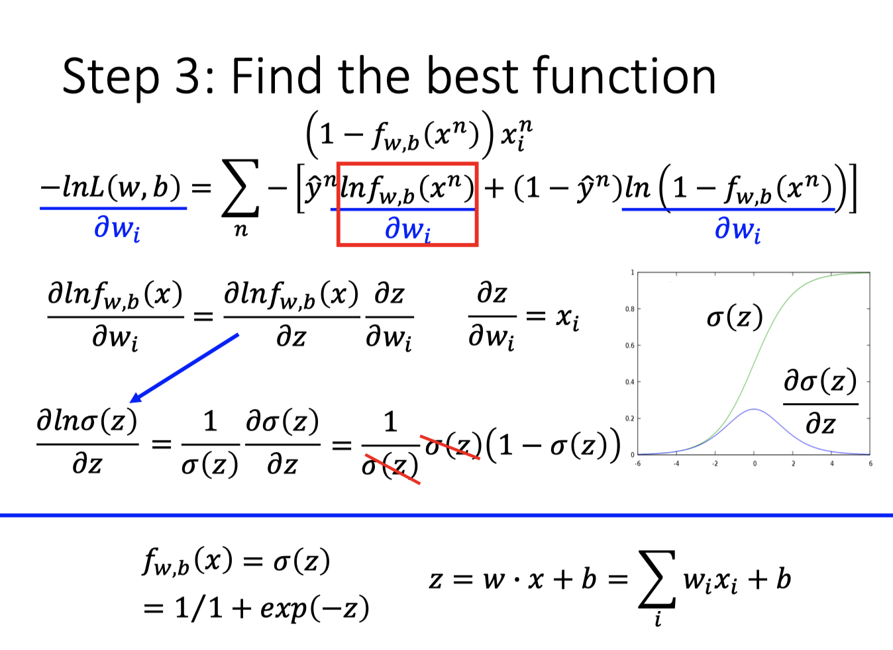
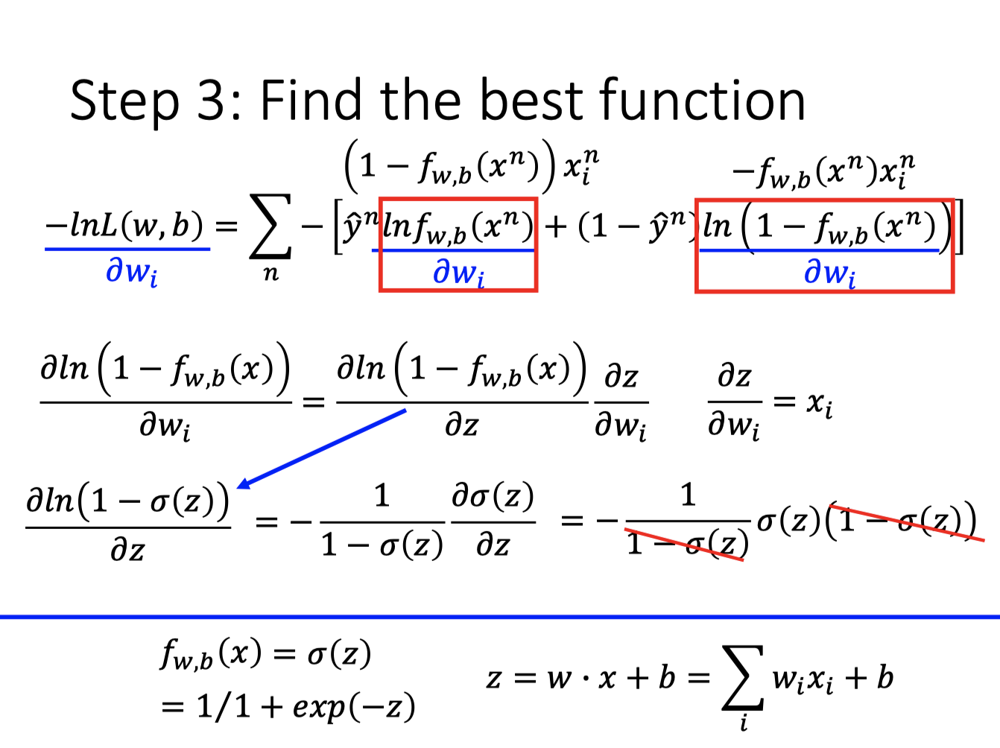
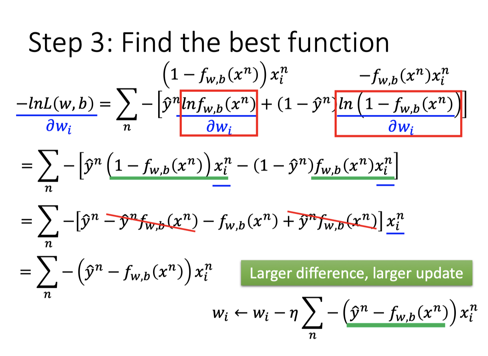

## Task5

## LR

> 和很多其他机器学习算法一样，逻辑回归也是从统计学中借鉴来的，尽管名字里有回归俩字儿，但它不是一个需要预测连续结果的回归算法。与之相反，Logistic 回归是二分类任务的首选方法。它输出一个 0 到 1 之间的离散二值结果。简单来说，它的结果不是 1 就是 0。
>
> Logistic 函数
> $$
> \sigma(t)=\frac{1}{1+\exp (-t)}
> $$
> 

### Logistic 回归模型预测

$$
\hat{y}=\left\{\begin{array}{l}{0 \text { if } \hat{p}<0.5} \\ {1 \text { if } \hat{p} \geq 0.5}\end{array}\right.
$$

### Logistic 回归模型的损失函数

 平方误差

$$
L(f)=\frac{1}{2} \sum_{n}\left(f_{w, b}\left(x^{n}\right)-\hat{y}^{n}\right)^{2}
$$

其中，
$$
f_{w, b}(x)=\sigma\left(\sum_{i} w_{i} x_{i}+b\right)
$$
交叉熵损失函数
$$
J(\boldsymbol{\theta})=-\frac{1}{m} \sum_{i=1}^{m}\left[y^{(i)} \log \left(\hat{p}^{(\hat{\imath})}\right)+\left(1-y^{(i)}\right) \log \left(1-\hat{p}^{(i)}\right)\right]
$$

对模型参数求偏导
$$
\frac{\partial}{\partial \theta_{j}} \mathrm{J}(\theta)=\frac{1}{m} \sum_{i=1}^{n}\left(\sigma\left(\theta^{T} \mathbf{x}^{(i)}\right)-y^{(i)}\right) x_{j}^{(i)}
$$
此时，可以通过梯度下降法对其进行求解，其梯度为
$$
\nabla_{\theta_{j}} J(\theta)=-\frac{1}{m} \sum_{i=1}^{m}\left[\frac{y^{(i)}}{h_{\theta}\left(\mathbf{x}^{(i)}\right)} \cdot \nabla_{\theta_{j}} h_{\theta}\left(\mathbf{x}^{(i)}\right)+\frac{1-y^{(i)}}{1-h_{\theta}\left(\mathbf{x}^{(i)}\right)} \cdot \nabla_{\theta_{j}}\left(1-h_{\theta}\left(\mathbf{x}^{(i)}\right)\right)\right]
$$

$$
=-\frac{1}{m} \sum_{i=1}^{m}\left[\frac{y^{(i)}}{h_{\theta}\left(\mathbf{x}^{(i)}\right)} \cdot \nabla_{\theta_{j}} h_{\theta}\left(\mathbf{x}^{(i)}\right)-\frac{1-y^{(i)}}{1-h_{\theta}\left(\mathbf{x}^{(i)}\right)} \cdot \nabla_{\theta_{j}} h_{\theta}\left(\mathbf{x}^{(i)}\right)\right]
$$

$$
=-\frac{1}{m} \sum_{i=1}^{m}\left[\left(\frac{y^{(i)}}{h_{\theta}\left(\mathbf{x}^{(i)}\right)}-\frac{1-y^{(i)}}{1-h_{\theta}\left(\mathbf{x}^{(i)}\right)}\right) \cdot \nabla \theta_{j} h_{\theta}\left(\mathbf{x}^{(i)}\right)\right]
$$

$$
=-\frac{1}{m} \sum_{i=1}^{m}\left[\frac{y^{(i)}-h_{\theta}\left(\mathbf{x}^{(i)}\right)}{h_{\theta}\left(\mathbf{x}^{(i)}\right)\left(1-h_{\theta}\left(\mathbf{x}^{(i)}\right)\right)} \cdot \nabla_{\theta_{j}} h_{\theta}\left(\mathbf{x}^{(i)}\right)\right]
$$

$$
=-\frac{1}{m} \sum_{i=1}^{m}\left[\frac{y^{(i)}-h_{\theta}\left(\mathbf{x}^{(i)}\right)}{h_{\theta}\left(\mathbf{x}^{(i)}\right)\left(1-h_{\theta}\left(\mathbf{x}^{(i)}\right)\right)} \cdot \nabla_{\theta^{T} \mathbf{X}^{(i)}} h_{\theta}\left(\mathbf{x}^{(i)}\right) \cdot \nabla_{\theta_{j}}\left(\theta^{T} \mathbf{x}^{(i)}\right)\right]
$$

而：
$$
\nabla_{\theta^{T} \mathbf{X}^{(i)}} h_{\theta}\left(\mathbf{x}^{(i)}\right)=h_{\theta}\left(\mathbf{x}^{(i)}\right)\left(1-h_{\theta}\left(\mathbf{x}^{(i)}\right)\right)
$$

$$
\nabla_{\theta_{j}}\left(\theta^{T} \mathbf{x}^{(i)}\right)=x_{j}^{(i)}
$$

因此，梯度的公式为：
$$
\nabla_{\theta_{j}} J(\theta)=-\frac{1}{m} \sum_{i=1}^{m}\left[\left(y^{(i)}-h_{\theta}\left(\mathbf{x}^{(i)}\right)\right) \cdot x_{j}^{(i)}\right]
$$
根据梯度下降法，得到如下的更新公式：
$$
\theta_{j} :=\theta_{j}-\alpha \nabla_{\theta_{j}} J(\theta)
$$

## Softmax

> Softmax是Logistic回归在多分类上的推广，即类标签y的取值大于等于2。假设有m个训练样本
> $$
> \left\{\left(\mathbf{X}^{(1)}, y^{(1)}\right),\left(\mathbf{X}^{(2)}, y^{(2)}\right), \cdots,\left(\mathbf{X}^{(m)}, y^{(m)}\right)\right\}
> $$
> 对于Softmax回归，其输入特征为：
> $$
> \mathbf{X}^{(i)} \in \mathfrak{R}^{n+1}
> $$
> 类标记为：
> $$
> y^{(i)} \in\{0,1, \cdots k\}
> $$
> 假设函数为对于每一个样本估计其所属的类别的概率
> $$
> p(y=j | \mathbf{x})
> $$
> 具体的假设函数为：
> $$
> h_{\theta}\left(\mathbf{x}^{(i)}\right)=\left[ \begin{array}{c}{p\left(y^{(i)}=1 | \mathbf{x}^{(i)} ; \theta\right)} \\ {p\left(y^{(i)}=2 | \mathbf{x}^{(i)} ; \theta\right)} \\ {\vdots} \\ {p\left(y^{(i)}=k | \mathbf{x}^{(i)} ; \theta\right)}\end{array}\right]=\frac{1}{\sum_{j=1}^{k} e^{\theta_{j}^{T} \mathbf{x}^{(i)}}} \left[ \begin{array}{c}{e^{\theta_{1}^{T} \mathbf{x}^{(i)}}} \\ {e^{\theta_{2}^{T} \mathbf{x}^{(i)}}} \\ {\vdots} \\ {e^{\theta_{k}^{T} \mathbf{x}^{(i)}}}\end{array}\right]
> $$
> 其中θ表示的向量，且
> $$
> \theta_{i} \in \mathfrak{R}^{n+1}
> $$
> 则对于每一个样本估计其所属的类别的概率为：
> $$
> p\left(y^{(i)}=j | \mathbf{x}^{(i)} ; \theta\right)=\frac{e^{\theta_{j}^{T} \mathbf{x}^{(i)}}}{\sum_{l=1}^{k} e^{\theta_{l}^{T} \mathbf{x}^{(i)}}}
> $$

## 参考

> https://blog.csdn.net/google19890102/article/details/49738427
>
> https://blog.csdn.net/jiandanjinxin/article/details/76360230
>
> 机器学习实战