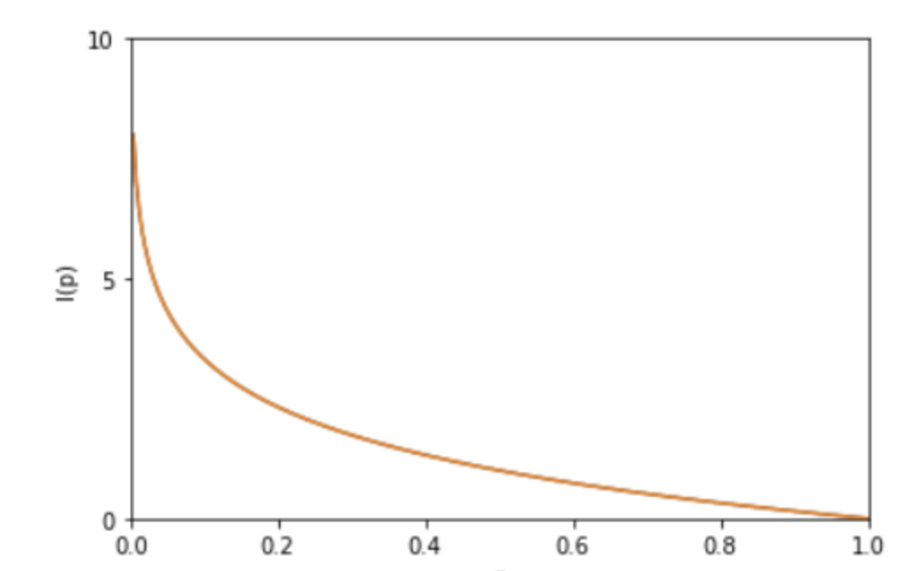

## Task7

### 信息熵 (information entropy)

> 一条信息的信息量大小和它的不确定性有直接的关系。我们需要搞清楚一件非常非常不确定的事，或者是我们一无所知的事，就需要了解大量的信息。相反，如果我们对某件事已经有了较多的了解，我们就不需要太多的信息就能把它搞清楚。所以，从这个角度，我们可以认为，信息量的度量就等于不确定性的多少。比如，有人说广东下雪了。对于这句话，我们是十分不确定的。因为广东几十年来下雪的次数寥寥无几。为了搞清楚，我们就要去看天气预报，新闻，询问在广东的朋友，而这就需要大量的信息，信息熵很高。再比如，中国男足进军2022年卡塔尔世界杯决赛圈。对于这句话，因为确定性很高，几乎不需要引入信息，信息熵很低。
>
> 考虑一个**离散的随机变量** x，由上面两个例子可知，信息的量度应该依赖于概率分布 p(x)，因此我们想要寻找一个函数 I(x)，它是概率 p(x) 的单调函数，表达了信息的内容。怎么寻找呢？如果我们有两个不相关的事件 x 和 y，那么观察两个事件同时发生时获得的信息量应该等于观察到事件各自发生时获得的信息之和，即
> $$
> I(x, y)=I(x)+I(y)
> $$
> 因为两个事件是独立不相关的，因此 p(x,y)=p(x)p(y)。根据这两个关系，很容易看出 I(x)一定与 p(x) 的对数有关 (因为对数的运算法则是
> $$
> \log _{a}(m n)=\log _{a} m+\log _{a} n 
> $$
> )。因此，我们有
> $$
> I(x)=-\log p(x)
> $$
> 其中负号是用来保证信息量是正数或者零。而 log 函数基的选择是任意的（信息论中基常常选择为2，因此信息的单位为比特bits；而机器学习中基常常选择为自然常数，因此单位常常被称为奈特nats），I(x) 也被称为随机变量 x 的自信息 (self-information)，描述的是随机变量的某个事件发生所带来的信息量。图像如图：
> 
>
> 
>
> 最后，我们正式引出信息熵。 现在假设一个发送者想传送一个随机变量的值给接收者。那么在这个过程中，他们传输的平均信息量可以通过求
> $$
> I(x)=-\log p(x)
> $$
> 关于概率分布 p(x)p(x) 的期望得到，即：
> $$
> H(X)=-\sum_{x} p(x) \log p(x)=-\sum_{i=1}^{n} p\left(x_{i}\right) \log p\left(x_{i}\right)
> $$
> H(X) 就被称为随机变量 x 的熵,它是表示随机变量不确定的度量，是对所有可能发生的事件产生的信息量的期望。 从公式可得，随机变量的取值个数越多，状态数也就越多，信息熵就越大，混乱程度就越大。当随机分布为均匀分布时，熵最大，且
> $$
> 0 \leq H(X) \leq \log n
> $$
> 将一维随机变量分布推广到多维随机变量分布，则其**联合熵 (Joint entropy)** 为：
> $$
> H(X, Y)=-\sum_{x, y} p(x, y) \log p(x, y)=-\sum_{i=1}^{n} \sum_{j=1}^{m} p\left(x_{i}, y_{i}\right) \log p\left(x_{i}, y_{i}\right)
> $$
> **注意点：**
>
> 1、熵只依赖于随机变量的分布,与随机变量取值无关，所以也可以将 X 的熵记作H(p)。
>
> 2、令0log0=0(因为某个取值概率可能为0)。

### 相对熵 (Relative entropy)

> 相对熵 (Relative entropy)也称KL散度 (Kullback–Leibler divergence)
>
> 设 p(x)、q(x) 是 离散随机变量 X 中取值的两个概率分布，则 p 对 q 的相对熵是：
> $$
> D_{K L}(p \| q)=\sum_{x} p(x) \log \frac{p(x)}{q(x)}=E_{p(x)} \log \frac{p(x)}{q(x)}
> $$
> **性质：**
>
> 1、如果 p(x) 和 q(x) 两个分布相同，那么相对熵等于0
>
> 2、
> $$
> D_{K L}(p \| q) \neq D_{K L}(q \| p)
> $$
> ,相对熵具有不对称性
>
> 3、
> $$
> D_{K L}(p \| q) \geq 0
> $$
> 证明如下：
> $$
> \begin{aligned} D_{K L}(p | q) &=\sum_{x} p(x) \log \frac{p(x)}{q(x)} \\ &=-\sum_{x} p(x) \log \frac{q(x)}{p(x)} \\ &=-E_{p(x)}\left(\log \frac{q(x)}{p(x)}\right) \\ & \geq-\log E_{p(x)}\left(\frac{q(x)}{p(x)}\right) \\ &=-\log \sum_{x} p(x) \frac{q(x)}{p(x)} \\ &=-\log \sum_{x}^{x} q(x) \end{aligned}
> $$
> 因为：
> $$
> \sum_{x} p(x)=1
> $$
> 所以：
> $$
> D_{K L}(p \| q) \geq 0
> $$
> **总结：相对熵可以用来衡量两个概率分布之间的差异，上面公式的意义就是求 pp 与 qq之间的对数差在 pp 上的期望值**

### 交叉熵 (Cross entropy)

> $$
> D_{K L}(p \| q)=\sum_{x} p(x) \log \frac{p(x)}{q(x)}=\sum_{x} p(x) \log p(x)-p(x) \log q(x)
> $$
>
> 由于：
> $$
> H(p)=-\sum_{x} p(x) \log p(x)
> $$
>
> $$
> H(p, q)=\sum_{x} p(x) \log \frac{1}{q(x)}=-\sum_{x} p(x) \log q(x)
> $$
>
> 所以：
> $$
> D_{K L}(p \| q)=H(p, q)-H(p)
> $$
> 当用非真实分布 q(x) 得到的平均码长比真实分布 p(x) 得到的平均码长多出的比特数就是相对熵）
>
> 又因为 ：
> $$
> D_{K L}(p \| q) \geq 0
> $$
> 所以 H(p,q)≥H(p)（当 p(x)=q(x) 时取等号，此时交叉熵等于信息熵）
>
> 并且当 H(p) 为常量时（注：在机器学习中，训练数据分布是固定的），最小化相对熵 
> $$
> D_{K L}(p \| q) \geq 0
> $$
> 等价于最小化交叉熵 H(p,q) 也等价于最大化似然估计

### 引用

> https://www.cnblogs.com/kyrieng/p/8694705.html
>
> [https://datawhalechina.github.io/Leeml-Book/#/AdditionalReferences/Entropy?id=%E8%AE%A1%E7%AE%97%E7%BB%99%E5%AE%9A%E6%95%B0%E6%8D%AE%E9%9B%86%E7%9A%84%E9%A6%99%E5%86%9C%E7%86%B5%EF%BC%9A](https://datawhalechina.github.io/Leeml-Book/#/AdditionalReferences/Entropy?id=计算给定数据集的香农熵：)