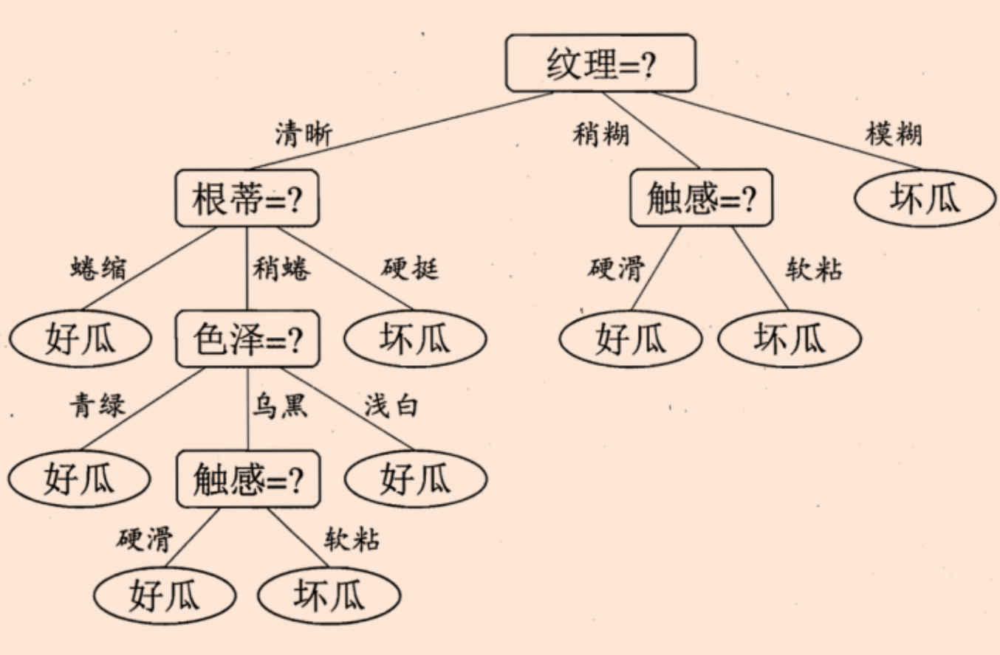
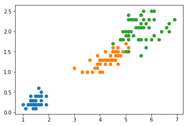
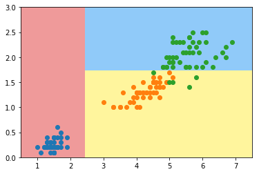

## Task8

### **决策树模型**

> - **结点和有向边组成**
> - **结点有内部结点和叶结点俩种类型**
> - **内部结点表示一个特征，叶节点表示一个类**

决策树表述：



### 决策树递归思想

> 决策树代表实例属性值约束的合取的析取式。从树根到树叶的每一条路径对应一组属性测试的合取，树本身对应这些合取的析取,**决策树的判定过程就相当于树中从根结点到某一个叶子结点的遍历。每一步如何遍历是由数据各个特征的具体特征属性决定**

### 信息增益

> 节点M的信息熵E1与其全部子节点信息熵之和E2的差
> $$
> g(D, A)=H(D)-H(D | A)
> $$
> 

### 信息增益率

> 节点信息增益与节点分裂信息度量的比值
> $$
> g_{R}(D, A)=\frac{g(D, A)}{H(A)}
> $$
> 

### 决策树的优点

> - **决策树易于理解和实现.** 人们在通过解释后都有能力去理解决策树所表达的意义。
> - **对于决策树，数据的准备往往是简单或者是不必要的 .** 其他的技术往往要求先把数据一般化，比如去掉多余的或者空白的属性。
> - **能够同时处理数据型和常规型属性。** 其他的技术往往要求数据属性的单一。
> - **是一个白盒模型**如果给定一个观察的模型，那么根据所产生的决策树很容易推出相应的逻辑表达式。
> - **易于通过静态测试来对模型进行评测。** 表示有可能测量该模型的可信度。
> - **在相对短的时间内能够对大型数据源做出可行且效果良好的结果**

### ID3算法优缺点

> 信息增益是ID3算法的基础
>
> D3算法十分简单，核心是根据“最大信息熵增益”原则选择划分当前数据集的最好特征，信息熵是信息论里面的概念，是信息的度量方式，不确定度越大或者说越混乱，熵就越大。在建立决策树的过程中，根据特征属性划分数据，使得原本“混乱”的数据的熵(混乱度)减少，按照不同特征划分数据熵减少的程度会不一样。在ID3中选择熵减少程度最大的特征来划分数据（贪心），也就是“最大信息熵增益”原则。同时这是最早提出的一种决策树方法，使用上述信息增益的方式建立。
>
> **缺点：只能处理离散型属性，并且对倾向于选择取值较多的属性**
>
> **缺点原因：信息增益反映的给定一个条件以后不确定性减少的程度,必然是分得越细的数据集确定性更高,也就是条件熵越小,信息增益越大**

### C4.5算法优缺点

> 信息增益率是C4.5算法的基础
>
> 优点：
>
> C4.5 主要针对 ID3 的缺陷作了一些优化改进，相当于是一个“升级版”的 ID3：
>
> 1. 能够处理连续型和离散型的数据。
> 2. 能够处理包含缺失值的数据。
> 3. 对生成的决策树进行了减枝。
> 4. 使用信息增益率作为属性选择的标准
>
> 缺点：
>
> 1. 在构造树的过程中，需要对数据集进行多次的顺序扫描和排序，因而导致算法的低效。
> 2. 精度不够高。商业上用 C5.0 而非 C4.5，就是因为它的预测精度还不能很好的满足用户的需求。
> 3. C4.5 只适合于能够驻留于内存的数据集，当训练集大得无法在内存容纳时，程序无法运行

### 决策树如何生成

#### 什么是决策树


```python
import numpy as np
import matplotlib.pyplot as plt
```


```python
from sklearn import datasets

iris = datasets.load_iris()
X = iris.data[:,2:]
y = iris.target
```


```python
plt.scatter(X[y==0,0], X[y==0,1])
plt.scatter(X[y==1,0], X[y==1,1])
plt.scatter(X[y==2,0], X[y==2,1])
plt.show()
```




```python
from sklearn.tree import DecisionTreeClassifier

dt_clf = DecisionTreeClassifier(max_depth=2, criterion="entropy", random_state=42)
dt_clf.fit(X, y)
```


    DecisionTreeClassifier(class_weight=None, criterion='entropy', max_depth=2,
                max_features=None, max_leaf_nodes=None,
                min_impurity_decrease=0.0, min_impurity_split=None,
                min_samples_leaf=1, min_samples_split=2,
                min_weight_fraction_leaf=0.0, presort=False, random_state=42,
                splitter='best')


```python
def plot_decision_boundary(model, axis):
    
    x0, x1 = np.meshgrid(
        np.linspace(axis[0], axis[1], int((axis[1]-axis[0])*100)).reshape(-1, 1),
        np.linspace(axis[2], axis[3], int((axis[3]-axis[2])*100)).reshape(-1, 1),
    )
    X_new = np.c_[x0.ravel(), x1.ravel()]

    y_predict = model.predict(X_new)
    zz = y_predict.reshape(x0.shape)

    from matplotlib.colors import ListedColormap
    custom_cmap = ListedColormap(['#EF9A9A','#FFF59D','#90CAF9'])
    
    plt.contourf(x0, x1, zz, cmap=custom_cmap)
```


```python
plot_decision_boundary(dt_clf, axis=[0.5, 7.5, 0, 3])
plt.scatter(X[y==0,0], X[y==0,1])
plt.scatter(X[y==1,0], X[y==1,1])
plt.scatter(X[y==2,0], X[y==2,1])
plt.show()
```




### 机器学习实战

