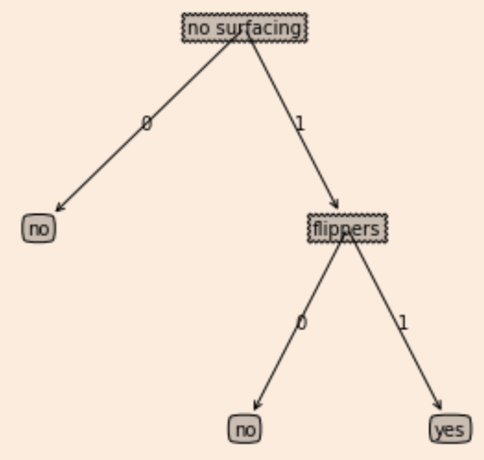

## Task9

### 使用Matlib注释绘制树图形

> 预先存储树信息

```python
def retrieveTree(i):
    listOfTrees =[{'no surfacing': {0: 'no', 1: {'flippers': {0: 'no', 1: 'yes'}}}},
                  {'no surfacing': {0: 'no', 1: {'flippers': 
                  {0: {'head': {0: 'no', 1: 'yes'}}, 1: 'no'}}}}
                 ]
    return listOfTrees[i]
```

> 定义节点样式
```python
def plotNode(nodeTxt,centerPt,parentPt,nodeType):
    createPlot.ax1.annotate(nodeTxt,xy=parentPt,xycoords='axes fraction',xytext=centerPt,textcoords='axes fraction',va="center", ha="center",bbox=nodeType,arrowprops=arrow_args)
```

> 获取叶子结点的数据

```python
def getNumLeafs(myTree):
    # 初始化结点数
    numLeafs=0
    firstSides = list(myTree.keys())
    # 找到输入的第一个元素,第一个关键词为划分数据集类别的标签
    firstStr = firstSides[0]
    secondDict = myTree[firstStr]
    # 测试数据是否为字典形式
    for key in secondDict.keys():
        # type判断子结点是否为字典类型
        if type(secondDict[key]).__name__=='dict':
            numLeafs+=getNumLeafs(secondDict[key])
            #若子节点也为字典，则也是判断结点，需要递归获取num
        else:  numLeafs+=1
    # 返回整棵树的结点数
    return numLeafs
```

> 获取树的深度

```python
def getTreeDepth(myTree):
    maxDepth = 0
    firstSides = list(myTree.keys())
    firstStr = firstSides[0]
    # 获取划分类别的标签
    secondDict = myTree[firstStr]
    for key in secondDict.keys():
        if type(secondDict[key]).__name__=='dict':
           thisDepth = 1 + getTreeDepth(secondDict[key])
        else: thisDepth = 1
        if thisDepth > maxDepth: maxDepth = thisDepth
    return maxDepth
```

> 在父子节点间填充文本信息

```python
def plotNode(nodeTxt, centerPt, parentPt, nodeType):
    createPlot.ax1.annotate(nodeTxt, xy=parentPt,  xycoords='axes fraction',
             xytext=centerPt, textcoords='axes fraction',
             va="center", ha="center", bbox=nodeType, arrowprops=arrow_args )
```

> 绘制树

```python
def plotTree(myTree, parentPt, nodeTxt):
    # 计算树的宽度  totalW
    numLeafs = getNumLeafs(myTree)
    # 计算树的高度 存储在totalD
    depth = getTreeDepth(myTree)
    firstSides = list(myTree.keys())
    # firstStr = myTree.keys()[0] 续作修改
    # 找到输入的第一个元素
    firstStr = firstSides[0] 
    # 按照叶子结点个数划分x轴
    cntrPt = (plotTree.xOff + (1.0 + float(numLeafs))/2.0/plotTree.totalW, plotTree.yOff)
    # 标注子结点属性值
    plotMidText(cntrPt, parentPt, nodeTxt) 
    plotNode(firstStr, cntrPt, parentPt, decisionNode)
    secondDict = myTree[firstStr]
    # y方向上的摆放位置，自上而下绘制，递减y值
    plotTree.yOff = plotTree.yOff - 1.0/plotTree.totalD 
    for key in secondDict.keys():
        # 判断是否为字典，不是则为叶子结点
        if type(secondDict[key]).__name__=='dict':
            # 递归查找
            plotTree(secondDict[key],cntrPt,str(key))
        # 到达叶子结点
        else:   
            # x方向计算结点坐标
            plotTree.xOff = plotTree.xOff + 1.0/plotTree.totalW
            plotNode(secondDict[key], (plotTree.xOff, plotTree.yOff), cntrPt, leafNode)
            # 添加文本信息
            plotMidText((plotTree.xOff, plotTree.yOff), cntrPt, str(key))
    # 下次重新调用时恢复y
    plotTree.yOff = plotTree.yOff + 1.0/plotTree.totalD 
```

> 绘制入口

```python
# 主函数
def createPlot(inTree): 
    fig = plt.figure(1, facecolor='white')
    fig.clf()
    axprops = dict(xticks=[], yticks=[])
    # 在绘图区上绘制两个代表不同类型的树节点
    createPlot.ax1 = plt.subplot(111, frameon=False, **axprops)
    plotTree.totalW = float(getNumLeafs(inTree))
    plotTree.totalD = float(getTreeDepth(inTree))
    plotTree.xOff = -0.5 / plotTree.totalW
    plotTree.yOff = 1.0
    plotTree(inTree, (0.5, 1.0), '')
    plt.show()
```

> 绘制结果

```python
createPlot(retrieveTree(0))
```

